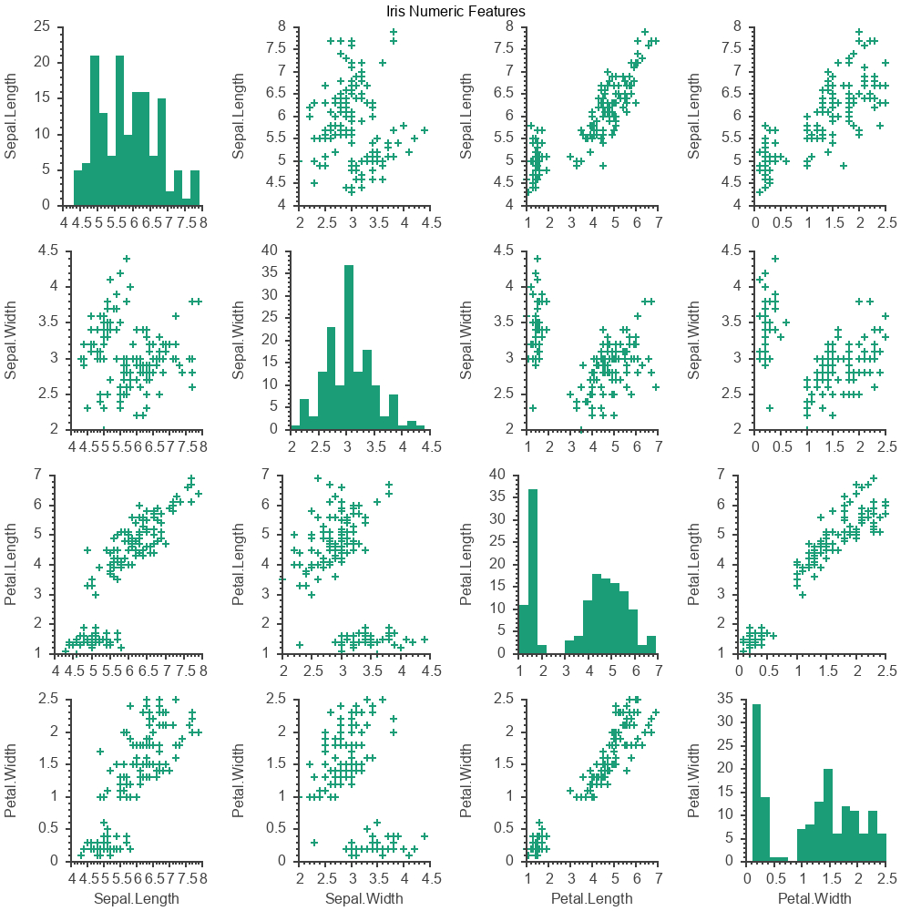
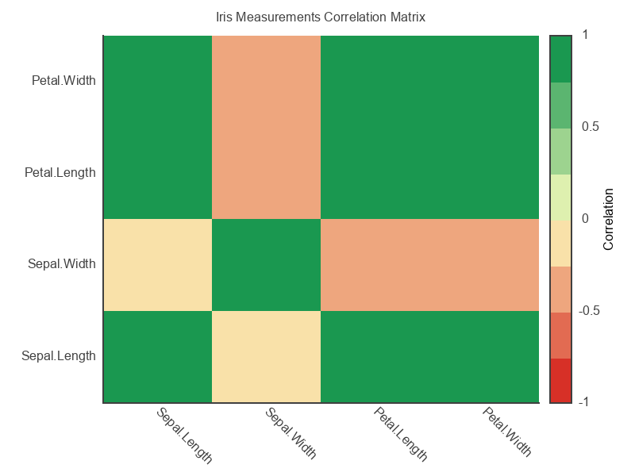
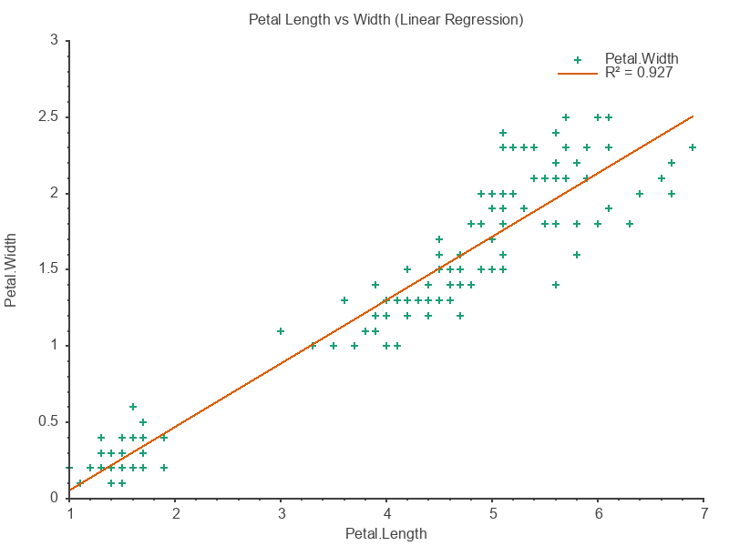
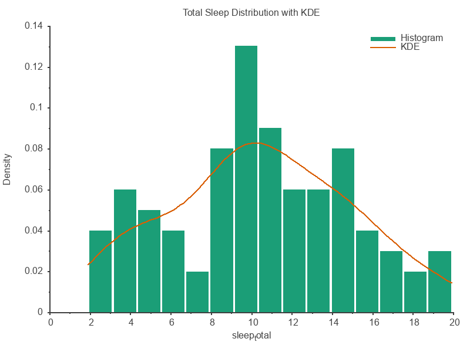
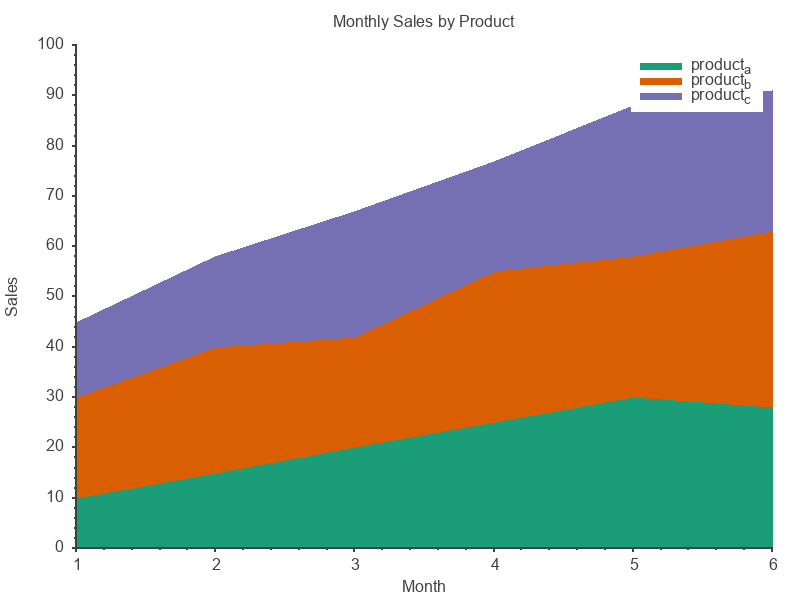

# crysda-plot

Seamless plotting integration for [Crysda](https://github.com/naqvis/CrysDA) DataFrames using [Cryplot](https://github.com/naqvis/cryplot).

- Line plots (single and multi-series, with optional sorting)
- Scatter plots with optional regression line
- Bar charts (simple, grouped, stacked)
- Area charts (stacked)
- Histograms, distribution plots with KDE, density curves
- Box plots, error bars, stem/lollipop charts
- Pie charts
- Correlation matrix and heatmaps
- Hexbin plots for large datasets
- Pairplot (scatter matrix) and Q-Q plots
- Grouped DataFrame support with automatic series labeling
- Faceted plots (small multiples)
- Configurable default figure size

## Gallery

<p align="center">
  
  
</p>
<p align="center">
  
  
  
</p>

## Installation

1. Add the dependency to your `shard.yml`:

```yaml
dependencies:
  crysda-plot:
    github: naqvis/crysda-plot
```

2. Run `shards install`

3. Ensure [gnuplot](http://www.gnuplot.info/) is installed on your system

## Usage

```crystal
require "crysda-plot"

# Load data from CSV (or create inline)
df = Crysda.read_csv("sales.csv")

# Simple line plot
df.plot_line("month", "sales").save("sales.png")

# Multiple series
df.plot_line("month", "sales", "costs")
  .xlabel("Month")
  .ylabel("Amount ($)")
  .save("financials.pdf")

# Scatter plot
df.plot_scatter("costs", "sales").show

# Bar chart
df.plot_bar("month", "sales").save("bar.png")

# Histogram
df.plot_histogram("sales", bins: 5).show

# Box plot
df.plot_box("sales", "costs").show
```

### Grouped DataFrames

```crystal
df = Crysda.dataframe_of("category", "x", "y").values(
  "A", 1, 10,
  "A", 2, 20,
  "B", 1, 15,
  "B", 2, 25
)

# Each group becomes a separate series with automatic labeling
df.group_by("category").plot_scatter("x", "y").show
df.group_by("category").plot_line("x", "y").save("grouped.png")

# Faceted plots (small multiples) - one subplot per group
df.group_by("category").plot_facet_scatter("x", "y").save("facets.png")
```

### Sorted Line Plots

```crystal
# Auto-sort by x column (useful for time series)
df.plot_line("date", "value", sorted: true).save("timeseries.png")
```

### Correlation Matrix

```crystal
# Visualize correlations between numeric columns
df.plot_correlation.save("correlations.png")
```

### Quick Value Counts Plot

```crystal
# Bar chart from value_counts result
df.count("category").plot_value_counts.save("counts.png")
```

### Pairplot

```crystal
# Grid of scatter plots for all numeric column pairs
# Diagonal shows histograms, off-diagonal shows scatter plots
df.plot_pairplot.save("pairplot.png")
```

### Regression Plot

```crystal
# Scatter plot with linear regression line and R² value
df.plot_regression("x", "y").save("regression.png")
```

### Distribution Plot

```crystal
# Histogram with KDE (kernel density estimation) overlay
df.plot_distribution("value").save("distribution.png")

# Without KDE
df.plot_distribution("value", kde: false).save("hist.png")

# Custom bin count
df.plot_distribution("value", bins: 30).save("dist.png")
```

### Grouped and Stacked Bar Charts

```crystal
# Side-by-side grouped bars
df.plot_grouped_bar("category", "sales", "costs", "profit").save("grouped.png")

# Stacked bars
df.plot_stacked_bar("category", "q1", "q2", "q3", "q4").save("stacked.png")
```

### Heatmap from Data

```crystal
# Create heatmap from x, y, value columns
df.plot_heatmap("row", "col", "value").save("heatmap.png")
```

### Configure Default Size

```crystal
# Change default figure dimensions (in points, 72 = 1 inch)
Crysda::PlotConfig.default_width = 1024
Crysda::PlotConfig.default_height = 768
```

### PlotBuilder API

```crystal
df.plot
  .scatter("x", "y")
  .title("My Scatter Plot")
  .xlabel("X Axis")
  .ylabel("Y Axis")
  .save("scatter.png")

df.plot
  .histogram("values", bins: 20)
  .title("Distribution")
  .show
```

## Available Methods

| Method                                        | Description                            |
| --------------------------------------------- | -------------------------------------- |
| `plot_line(x, y, sorted: false)`              | Line plot with single series           |
| `plot_line(x, y1, y2, ..., sorted: false)`    | Line plot with multiple series         |
| `plot_scatter(x, y)`                          | Scatter plot                           |
| `plot_regression(x, y)`                       | Scatter with regression line and R²    |
| `plot_bar(x, y)`                              | Bar chart                              |
| `plot_grouped_bar(x, y1, y2, ...)`            | Grouped bar chart (side by side)       |
| `plot_stacked_bar(x, y1, y2, ...)`            | Stacked bar chart                      |
| `plot_area(x, y1, y2, ...)`                   | Stacked area chart                     |
| `plot_histogram(col, bins: 10)`               | Histogram                              |
| `plot_distribution(col, bins: 20, kde: true)` | Histogram with optional KDE overlay    |
| `plot_density(*cols)`                         | KDE density curves                     |
| `plot_box(col1, col2, ...)`                   | Box plot                               |
| `plot_errorbar(x, y, yerr)`                   | Scatter with error bars                |
| `plot_stem(x, y)`                             | Stem/lollipop chart                    |
| `plot_pie(labels, values)`                    | Pie chart                              |
| `plot_correlation`                            | Correlation matrix heatmap             |
| `plot_heatmap(x, y, value)`                   | Heatmap from three columns             |
| `plot_hexbin(x, y, bins: 20)`                 | Hexagonal binning for large data       |
| `plot_pairplot`                               | Scatter matrix for all numeric columns |
| `plot_qq(col)`                                | Q-Q plot for normality check           |
| `plot_value_counts`                           | Bar chart from count result            |
| `plot`                                        | Returns PlotBuilder for fluent API     |

### Grouped DataFrame Methods

| Method                                 | Description                   |
| -------------------------------------- | ----------------------------- |
| `plot_scatter(x, y)`                   | Scatter with series per group |
| `plot_line(x, y, sorted: false)`       | Line with series per group    |
| `plot_facet_scatter(x, y)`             | Small multiples scatter       |
| `plot_facet_line(x, y, sorted: false)` | Small multiples line          |

All methods return a `Cryplot::Plot` (or `Cryplot::Figure` for facets), allowing you to chain additional styling methods.

## Development

```bash
crystal spec
```

## Examples

See the [examples/](examples/) directory for complete working examples with the Iris and Sleep datasets.

## Contributing

1. Fork it (<https://github.com/naqvis/crysda-plot/fork>)
2. Create your feature branch (`git checkout -b my-new-feature`)
3. Commit your changes (`git commit -am 'Add some feature'`)
4. Push to the branch (`git push origin my-new-feature`)
5. Create a new Pull Request

## Contributors

- [Ali Naqvi](https://github.com/naqvis) - creator and maintainer
